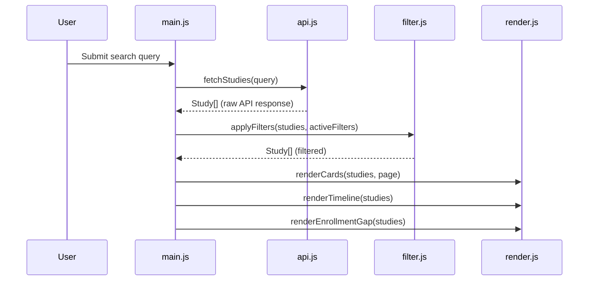

# Design Document: Clinical Trial Dashboard

## Overview

The Clinical Trial Dashboard is a fully static, client-side single-page application (SPA) that queries the ClinicalTrials.gov v2 REST API and presents clinical trial data in a data-dense, professional interface. There is no backend — all logic runs in the browser.

The app targets clinical operations professionals who need to quickly assess trial health, enrollment status, and timelines across a portfolio of studies. Key capabilities include free-text search, multi-dimensional filtering, a color-coded health scorecard per study, a horizontal timeline view, and an enrollment gap panel.

The app is deployable to GitHub Pages as a static asset bundle (HTML + CSS + vanilla JS).

### Key Design Decisions

- **Vanilla JS, no framework**: Keeps the bundle zero-dependency and trivially deployable. The DOM manipulation surface is manageable given the app's scope.
- **Client-side filtering**: Filters operate on the in-memory result set returned by the last API call, avoiding redundant network requests and enabling instant filter feedback.
- **Module pattern**: JS is organized into ES modules (search, filter, render, scorecard, timeline, enrollment-gap) loaded via `<script type="module">`. No bundler required for GitHub Pages.
- **ClinicalTrials.gov v2 API**: Uses the `/studies` endpoint with `query.term`, `pageSize`, and `pageToken` parameters. Fields are requested explicitly via the `fields` parameter to minimize payload size.

---

## Architecture

The app is a single HTML page that loads a set of ES modules. There is no build step.

```
index.html
├── css/
│   └── styles.css
└── js/
    ├── main.js          # Entry point: wires up event listeners, orchestrates modules
    ├── api.js           # ClinicalTrials.gov v2 fetch wrapper
    ├── filter.js        # Client-side filter logic
    ├── scorecard.js     # Health scorecard computation
    ├── render.js        # DOM rendering: Study Cards, pagination
    ├── timeline.js      # Timeline View (SVG-based bar chart)
    └── enrollment.js    # Enrollment Gap Section logic
```

### Data Flow



### Module Responsibilities

| Module | Responsibility |
|---|---|
| `main.js` | Event wiring, state management (current studies, active filters, current page) |
| `api.js` | Fetch wrapper with timeout, error handling, field selection |
| `filter.js` | Pure functions: apply phase/status/sponsor filters to a Study array |
| `scorecard.js` | Pure function: compute Green/Yellow/Red for a single Study |
| `render.js` | DOM manipulation: cards, pagination controls, error/empty states |
| `timeline.js` | SVG timeline bar chart rendering |
| `enrollment.js` | Compute and render enrollment gap list |

---

## Components and Interfaces

### api.js

```js
/**
 * Fetch studies from ClinicalTrials.gov v2 API.
 * @param {string} query - Free-text search term
 * @param {number} pageSize - Number of results (default 100, max 1000)
 * @param {string|null} pageToken - Pagination token for next page
 * @returns {Promise<{studies: Study[], nextPageToken: string|null}>}
 * @throws {ApiError} on HTTP error or timeout
 */
export async function fetchStudies(query, pageSize = 100, pageToken = null)

/**
 * @typedef {Object} ApiError
 * @property {'timeout'|'http'|'network'} type
 * @property {string} message
 * @property {number|null} status
 */
```

The fetch wrapper sets a 15-second `AbortController` timeout. It requests only the fields needed by the app via the `fields` query parameter.

### filter.js

```js
/**
 * Apply active filters to a study array. Pure function.
 * @param {Study[]} studies
 * @param {FilterState} filters
 * @returns {Study[]}
 */
export function applyFilters(studies, filters)

/**
 * @typedef {Object} FilterState
 * @property {string[]} phases    - e.g. ['PHASE1', 'PHASE2']
 * @property {string[]} statuses  - e.g. ['RECRUITING']
 * @property {string[]} sponsorTypes - e.g. ['NIH', 'INDUSTRY']
 */
```

Filter logic: OR within category, AND across categories. An empty array for a category means "no filter applied" for that category.

### scorecard.js

```js
/**
 * Compute health scorecard for a single study.
 * @param {Study} study
 * @returns {'GREEN'|'YELLOW'|'RED'}
 */
export function computeScorecard(study)
```

### render.js

```js
export function renderCards(studies, page, pageSize)
export function renderPagination(totalCount, currentPage, pageSize)
export function renderError(message)
export function renderEmpty()
export function clearResults()
```

### timeline.js

```js
/**
 * Render the SVG timeline into #timeline-container.
 * @param {Study[]} studies - Already filtered; capped at 50 nearest completion
 */
export function renderTimeline(studies)
```

### enrollment.js

```js
/**
 * Compute enrollment gap for a study.
 * @param {Study} study
 * @returns {{nctId: string, target: number, gap: number, elapsedDays: number}|null}
 * null when data is insufficient
 */
export function computeEnrollmentGap(study)

/**
 * Render the enrollment gap section into #enrollment-gap-container.
 * @param {Study[]} studies
 */
export function renderEnrollmentGap(studies)
```

---

## Data Models

### Study (normalized from API response)

```js
/**
 * @typedef {Object} Study
 * @property {string} nctId                    - NCT number (e.g. "NCT04567890")
 * @property {string} title                    - Official study title
 * @property {string|null} phase               - "PHASE1"|"PHASE2"|"PHASE3"|"PHASE4"|null
 * @property {string} status                   - "RECRUITING"|"ACTIVE"|"COMPLETED"|"TERMINATED"|...
 * @property {string|null} sponsorName         - Lead sponsor name
 * @property {'NIH'|'INDUSTRY'|'ACADEMIC'|null} sponsorType
 * @property {number|null} enrollmentTarget    - Target enrollment count
 * @property {number|null} enrollmentActual    - Actual enrollment count
 * @property {string|null} startDate           - ISO date string "YYYY-MM-DD"
 * @property {string|null} completionDate      - ISO date string "YYYY-MM-DD"
 * @property {'GREEN'|'YELLOW'|'RED'} scorecard - Computed by scorecard.js
 */
```

### FilterState

```js
/**
 * @typedef {Object} FilterState
 * @property {string[]} phases
 * @property {string[]} statuses
 * @property {string[]} sponsorTypes
 */
```

### AppState (held in main.js module scope)

```js
/**
 * @typedef {Object} AppState
 * @property {Study[]} allStudies       - Raw results from last API call
 * @property {Study[]} filteredStudies  - After applyFilters()
 * @property {FilterState} filters
 * @property {number} currentPage       - 1-indexed
 * @property {boolean} loading
 * @property {string|null} lastQuery
 */
```

### Scorecard Computation Rules

| Condition | Score |
|---|---|
| Status = Terminated | RED |
| Start date unavailable | YELLOW |
| Enrollment < 50% of expected pace OR age > 125% of typical phase duration | RED |
| Enrollment 50–80% of expected pace OR age 100–125% of typical phase duration | YELLOW |
| Otherwise | GREEN |

Typical phase durations used for age comparison:

| Phase | Typical Duration |
|---|---|
| Phase I | 2 years |
| Phase II | 3 years |
| Phase III | 5 years |
| Phase IV | 4 years |
| Unknown | 3 years (default) |

Expected enrollment pace = `enrollmentTarget * (elapsedDays / totalExpectedDays)` where `totalExpectedDays = completionDate - startDate`.

---

## Correctness Properties

*A property is a characteristic or behavior that should hold true across all valid executions of a system — essentially, a formal statement about what the system should do. Properties serve as the bridge between human-readable specifications and machine-verifiable correctness guarantees.*


### Property 1: API call passes query term

*For any* non-empty search query string, calling `fetchStudies(query)` should result in an HTTP request to the ClinicalTrials.gov API that includes that query string as the search term parameter.

**Validates: Requirements 1.2**

### Property 2: Card count equals study count

*For any* array of studies returned by the API (or after filtering), the number of Study_Card elements rendered on the current page should equal `min(studies.length, pageSize)`, and the total card count across all pages should equal `studies.length`.

**Validates: Requirements 1.3, 2.8**

### Property 3: Error response preserves previous results

*For any* previous result set and any API error (HTTP error, network error, or timeout), the set of rendered Study_Cards after the error should be identical to the set rendered before the error, and a non-empty error message should be displayed.

**Validates: Requirements 1.5, 1.6**

### Property 4: Filter correctness — OR within category, AND across categories

*For any* study array and any FilterState, `applyFilters(studies, filters)` should return exactly the studies that satisfy: for each category with at least one selected value, the study matches at least one of those values. A category with an empty selection array should not exclude any study. The result should always be a subset of the input.

**Validates: Requirements 2.4, 2.5, 2.6, 2.7**

### Property 5: Study_Card renders all required fields with N/A fallback

*For any* Study object, the rendered Study_Card HTML should contain the NCT number, title, phase, status, sponsor name, enrollment target, start date, estimated completion date, and scorecard indicator. For any field that is null or undefined on the Study, the rendered card should display "N/A" for that field.

**Validates: Requirements 3.1, 3.2, 3.5**

### Property 6: Pagination shows exactly 20 cards per page

*For any* study array with more than 20 entries, rendering page N should produce exactly 20 Study_Card elements (or fewer for the last page), and the union of all pages should cover all studies exactly once.

**Validates: Requirements 3.4**

### Property 7: Scorecard computation correctness

*For any* Study object, `computeScorecard(study)` should return:
- RED if `status === 'TERMINATED'`, or enrollment pace < 50% of expected, or study age > 125% of typical phase duration
- YELLOW if `startDate` is null, or enrollment pace is 50–80% of expected, or study age is 100–125% of typical phase duration
- GREEN otherwise (enrollment on track, age appropriate, no adverse flags)

The function should never return a value outside `{'GREEN', 'YELLOW', 'RED'}`.

**Validates: Requirements 4.1, 4.2, 4.3, 4.5**

### Property 8: Timeline bar spans correct date range

*For any* Study with both a valid startDate and completionDate, the rendered SVG bar for that study should have its left edge positioned at the startDate and its right edge at the completionDate on the shared time axis.

**Validates: Requirements 5.1**

### Property 9: Timeline omits studies with missing dates and counts omissions

*For any* study array where some studies have null startDate or completionDate, `renderTimeline` should exclude those studies from the SVG bars, and the displayed omission count should equal the number of excluded studies.

**Validates: Requirements 5.3**

### Property 10: Timeline capped at 50 nearest completion

*For any* filtered study array with more than 50 studies that have valid dates, `renderTimeline` should render exactly 50 bars, and those 50 studies should be the ones with the earliest (nearest) completionDate values in the set.

**Validates: Requirements 5.5**

### Property 11: Timeline axis bounds match data range

*For any* study array rendered in the timeline, the left bound of the time axis should equal the minimum startDate across all rendered studies, and the right bound should equal the maximum completionDate.

**Validates: Requirements 5.6**

### Property 12: Enrollment gap list contains only under-enrolled studies

*For any* study array, every study listed in the Enrollment_Gap_Section should satisfy `enrollmentActual < expectedEnrollment(study)`, and no study satisfying that condition should be absent from the list (excluding studies with missing data).

**Validates: Requirements 6.1**

### Property 13: Enrollment gap section sorted descending by gap

*For any* study array, the enrollment gap values in the rendered Enrollment_Gap_Section should be in non-increasing order (largest gap first).

**Validates: Requirements 6.3**

### Property 14: Enrollment gap excluded count matches missing-data studies

*For any* study array, the excluded study count displayed in the Enrollment_Gap_Section should equal the number of studies in the input array that have null enrollmentTarget or null startDate.

**Validates: Requirements 6.5**

---

## Error Handling

### API Errors

| Error Type | Detection | User-Facing Behavior |
|---|---|---|
| Empty query | Before fetch | Validation message; no API call made |
| HTTP 4xx/5xx | `response.ok === false` | Display status code + message; preserve previous results |
| Network failure | `fetch` rejects | Display "Network error" message; preserve previous results |
| Timeout (15s) | `AbortController` signal | Display "Request timed out" + retry button; preserve previous results |
| Fetch API unavailable | `typeof fetch === 'undefined'` | Display browser compatibility warning on page load |

### Data Gaps

| Missing Data | Behavior |
|---|---|
| Any Study field null | Render "N/A" in Study_Card |
| startDate or completionDate null | Omit from Timeline_View; increment omission counter |
| enrollmentTarget or startDate null | Omit from Enrollment_Gap_Section; increment excluded counter |
| enrollmentTarget null for scorecard | Score based on age vs. phase and status only |
| startDate null for scorecard | Assign YELLOW by default |

### State Preservation

On any API error, `AppState.allStudies` and `AppState.filteredStudies` are not mutated. The previous render remains visible beneath the error banner.

---

## Testing Strategy

### Dual Testing Approach

Both unit tests and property-based tests are required. They are complementary:

- **Unit tests** cover specific examples, integration points, and edge cases (empty query, timeout, browser compatibility warning, "all on track" message, today marker presence).
- **Property-based tests** verify universal correctness across all valid inputs for each Correctness Property defined above.

### Property-Based Testing Library

Use **fast-check** (JavaScript) for property-based testing. It integrates with Vitest/Jest and supports arbitrary generators for objects, arrays, dates, and strings.

Install: `npm install --save-dev fast-check`

Each property test must run a minimum of **100 iterations**.

Each property test must include a comment tag in the format:
```
// Feature: clinical-trial-dashboard, Property N: <property_text>
```

### Property Test Mapping

| Design Property | Test File | fast-check Arbitraries |
|---|---|---|
| P1: API call passes query | `api.test.js` | `fc.string({ minLength: 1 })` |
| P2: Card count equals study count | `render.test.js` | `fc.array(studyArb)` |
| P3: Error preserves previous results | `main.test.js` | `fc.array(studyArb)`, error type enum |
| P4: Filter correctness | `filter.test.js` | `fc.array(studyArb)`, `filterStateArb` |
| P5: Card renders required fields | `render.test.js` | `studyArb` with nullable fields |
| P6: Pagination 20 per page | `render.test.js` | `fc.array(studyArb, { minLength: 21 })` |
| P7: Scorecard computation | `scorecard.test.js` | `studyArb` covering all branches |
| P8: Timeline bar date range | `timeline.test.js` | `studyArb` with valid dates |
| P9: Timeline omits missing dates | `timeline.test.js` | `fc.array(studyArb)` with some null dates |
| P10: Timeline capped at 50 | `timeline.test.js` | `fc.array(studyArb, { minLength: 51 })` |
| P11: Timeline axis bounds | `timeline.test.js` | `fc.array(studyArb, { minLength: 1 })` |
| P12: Gap list under-enrolled only | `enrollment.test.js` | `fc.array(studyArb)` |
| P13: Gap sorted descending | `enrollment.test.js` | `fc.array(studyArb)` |
| P14: Gap excluded count | `enrollment.test.js` | `fc.array(studyArb)` with null fields |

### Unit Test Coverage

Unit tests (Vitest) should cover:

- Empty query validation (Req 1.4)
- Timeout error display and retry button (Req 1.6)
- Filter_Panel DOM structure — phase, status, sponsor checkboxes present (Req 2.1–2.3)
- Timeline "today" marker present (Req 5.2)
- Enrollment gap "all on track" message when gap list is empty (Req 6.4)
- Browser Fetch API compatibility warning (Req 7.4)

### Test File Structure

```
tests/
├── api.test.js
├── filter.test.js
├── scorecard.test.js
├── render.test.js
├── timeline.test.js
└── enrollment.test.js
```
